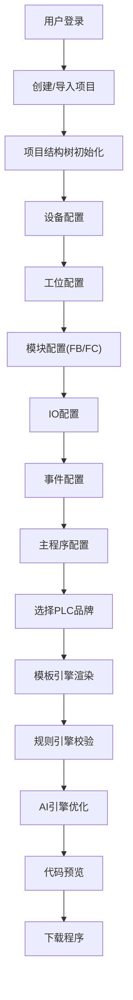

## 1. 产品概述

PLC代码生成器是一款面向工业自动化领域的智能编程平台，基于模板引擎、规则引擎和AI引擎三大核心技术，为工程师提供标准化、灵活化、智能化的PLC程序开发体验。用户可通过可视化配置完成设备、工位、模块、IO、事件等全链路配置，一键生成支持多品牌（西门子、三菱、欧姆龙等）的PLC控制程序。

- **核心价值**：大幅缩短PLC程序开发周期，降低编程门槛，提升代码标准化程度和可维护性
- **目标用户**：自动化工程师、电气设计师、设备制造商、系统集成商
- **市场定位**：工业4.0时代的智能PLC编程工具，填补可视化配置与自动代码生成之间的空白

## 2. 核心功能

### 2.1 用户角色

| 角色 | 注册方式 | 核心权限 |
|------|----------|----------|
| 工程师用户 | 账号注册/企业SSO | 项目创建、配置编辑、模板管理、代码生成与下载 |
| 管理员用户 | 企业管理员分配 | 用户管理、模板库审核、规则配置、系统设置 |

### 2.2 功能模块

1. **项目管理中心**：项目结构树、新建/导入项目、模板导入、版本管理
2. **模板引擎模块**：模板库管理、模板编辑器、模板变量定义、模板导入导出
3. **规则引擎模块**：规则配置、条件编辑器、动作定义、规则测试验证
4. **AI引擎模块**：智能代码补全、逻辑推荐、异常检测、自然语言生成
5. **设备配置中心**：三色灯配置、按钮配置、传感器配置、执行器配置
6. **工位配置中心**：工位定义、工位时序、工位互锁、工位状态管理
7. **模块配置中心**：FB功能块配置、FC函数配置、模块实例化、参数配置
8. **IO配置中心**：IO点位映射、地址分配、信号类型配置、IO分组管理
9. **事件配置中心**：事件定义、触发条件、响应动作、事件优先级
10. **主程序配置**：整机启动逻辑、整机停止逻辑、报警管理、状态机配置
11. **代码生成与下载**：品牌选择（西门子/三菱/欧姆龙/台达）、代码预览、一键下载、版本导出

### 2.3 页面详情

| 页面名称 | 模块名称 | 功能描述 |
|----------|----------|----------|
| 工作台 | 项目概览 | 展示项目列表、快速创建、最近打开、模板推荐 |
| 工作台 | 项目结构树 | 左侧树形导航，展示项目完整层级结构 |
| 模板管理 | 模板库 | 分类展示可用模板，支持搜索、筛选、收藏 |
| 模板管理 | 模板编辑器 | 可视化编辑模板内容、定义变量、预览效果 |
| 规则配置 | 规则列表 | 展示所有规则，支持增删改查、启用/禁用 |
| 规则配置 | 规则编辑器 | 条件+动作可视化编辑，支持拖拽式规则构建 |
| AI助手 | AI对话面板 | 自然语言交互，智能推荐，代码解释 |
| 设备配置 | 设备组件面板 | 三色灯、按钮、传感器等组件拖拽配置 |
| 设备配置 | 属性编辑器 | 选中设备的参数配置、IO绑定、逻辑设置 |
| 工位配置 | 工位列表 | 工位新增/删除/排序，工位状态可视化 |
| 工位配置 | 工位时序图 | 甘特图展示工位时序，支持拖拽调整 |
| 模块配置 | FB/FC库 | 功能块/函数库浏览，支持自定义模块 |
| 模块配置 | 模块实例化 | 模块拖拽实例化，参数配置，引脚连接 |
| IO配置 | IO矩阵 | 输入输出点矩阵展示，地址自动分配 |
| IO配置 | IO映射表 | 点位与设备绑定关系管理 |
| 事件配置 | 事件列表 | 事件定义、触发条件配置、响应动作链 |
| 主程序配置 | 启动逻辑 | 整机启动流程、条件判断、时序控制 |
| 主程序配置 | 停止逻辑 | 正常停止、紧急停止、安全停止策略 |
| 主程序配置 | 报警管理 | 报警等级、报警代码、报警处理逻辑 |
| 代码生成 | 品牌选择器 | 选择PLC品牌型号，配置通信参数 |
| 代码生成 | 代码预览 | 生成代码实时预览，语法高亮，支持编辑 |
| 代码生成 | 下载中心 | 一键下载程序文件，支持多种导出格式 |

## 3. 核心流程

### 3.1 项目创建流程
用户从工作台创建新项目，选择项目模板（或空白项目），系统自动初始化项目结构树，包含主程序、工位程序、设备配置、IO配置等默认节点。

### 3.2 配置流程
用户通过左侧项目树导航到各配置页面，依次完成设备配置→工位配置→模块配置→IO配置→事件配置→主程序配置的全链路配置，每一步配置实时保存并可预览效果。

### 3.3 代码生成流程
用户选择目标PLC品牌和型号，系统调用模板引擎+规则引擎+AI引擎进行代码生成，生成过程中展示进度，生成完成后提供代码预览、验证和下载功能。

## 4. 用户界面设计

### 4.1 设计风格
- **主色调**：工业蓝（#165DFF）+ 深灰（#1D2129），体现工业科技感
- **辅助色**：成功绿（#00B42A）、警告橙（#FF7D00）、危险红（#F53F3F），对应工业设备状态
- **字体**：JetBrains Mono（代码区）+ IBM Plex Sans（界面文字），工业风与可读性兼具
- **布局风格**：三栏式布局（左项目树 + 中配置区 + 右属性面板），专业IDE风格
- **图标风格**：线性图标，科技感强，统一 stroke 宽度

### 4.2 视觉特色
- 深色主题为主，符合工业软件使用习惯，降低长时间使用视觉疲劳
- 代码编辑器采用Monaco风格，语法高亮清晰
- 树形结构支持拖拽排序，操作流畅
- 配置面板采用卡片式分组，信息层级清晰
- 微动效：节点展开/收起、配置切换、状态变化均有平滑过渡

### 4.3 页面设计概览

| 页面名称 | 模块名称 | UI元素 |
|----------|----------|--------|
| 工作台 | 项目概览 | 渐变英雄区、项目卡片网格、快捷操作按钮、模板推荐轮播 |
| 配置页面 | 项目树 | 可折叠树节点、图标+文字、拖拽指示、选中高亮、右键菜单 |
| 配置页面 | 配置主区 | Tab页签切换、表单分组、拖拽组件库、可视化画布 |
| 配置页面 | 属性面板 | 折叠面板、输入控件、开关、选择器、颜色选择器 |
| 代码预览 | 代码编辑器 | 行号、语法高亮、折叠区域、 minimap、搜索替换 |
| AI助手 | 对话面板 | 聊天气泡、快捷问题、代码块展示、复制按钮 |

### 4.4 响应式设计
- 桌面端（1440px+）：三栏完整布局，充分利用大屏空间
- 平板端（1024-1440px）：属性面板可收起，配置区自适应
- 移动端：暂不支持（专业工业软件，主要面向桌面端用户）
