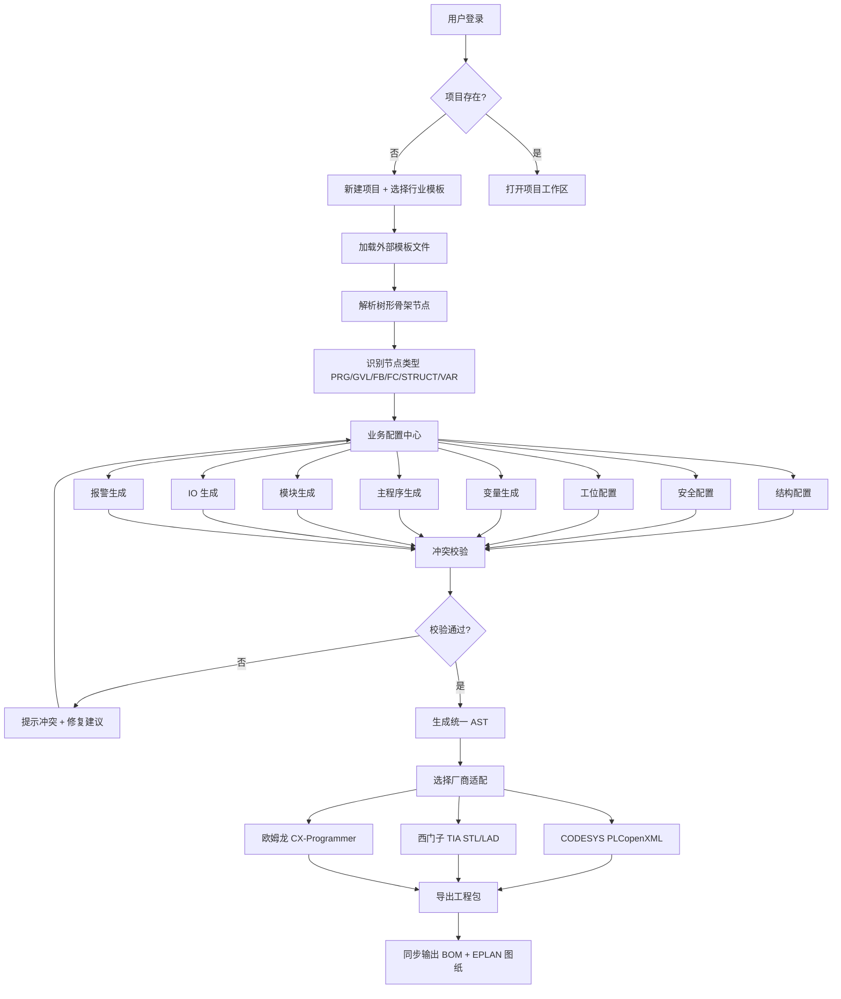

# XGenCode 产品需求文档 (PRD)

## 1. 产品概述

XGenCode 是一款面向工业自动化电气工程师的 PLC 代码生成器，覆盖项目初始化、业务配置、跨平台导出全流程。通过外部模板 + 树形节点骨架机制，一键生成 CODESYS / 西门子 / 欧姆龙 多品牌 PLC 工程，并支持权限管理与多人并发协作。

- **目标用户**：锂电、光伏、玻璃检测等行业的电气工程师、PLC 程序员、项目经理
- **核心价值**：标准化兜底（强制 PRG/GVL 根节点）+ 高度自定义扩展（非根节点全可编辑）+ 多品牌兼容（PLCopenXML 中间层）+ 全自动化链路（结构/工位/IO/报警到导出）

## 2. 核心功能

### 2.1 用户角色

| 角色 | 注册方式 | 核心权限 |
|------|---------|----------|
| 管理员 | 后台预置 | 用户管理、模板管理、项目审批、全局配置 |
| 工程师 | 管理员邀请/审批 | 创建/编辑项目、配置业务、生成代码、导入导出 |
| 访客 | 管理员分配 | 只读浏览项目、下载生成结果 |
| 模板维护员 | 管理员分配 | 维护业务模板版本、发布模板、回滚 |

### 2.2 功能模块

1. **登录与工作台**：登录注册、项目仪表盘、待办、最近活动
2. **项目初始化**：新建项目、选择业务模板、加载/解析模板、识别骨架节点类型
3. **业务配置中心**：结构配置 / 安全配置 / 工位配置 / 变量生成 / 主程序 / 模块 / IO / 报警 八大子模块
4. **跨平台导出**：AST 预览、PLCopenXML 中间层、CODESYS / 西门子 / 欧姆龙 适配
5. **模板管理**：版本管理、回滚、行业模板库（锂电/光伏/玻璃检测）
6. **冲突校验与同步**：IO 地址、结构体重名、FB 实例命名、安全信号缺失校验；双向同步导入
7. **用户与权限管理**：角色、权限矩阵、并发协作锁
8. **BOM/图纸输出**：电气 BOM 清单、EPLAN 图纸数据配套输出

### 2.3 页面详情

| 页面名称 | 模块名称 | 功能描述 |
|---------|---------|---------|
| 登录注册页 | 认证卡片 | 账号/密码登录、邀请码注册、SSO 入口 |
| 工作台仪表盘 | 项目网格 | 项目卡片、状态徽标、协作者头像、快速操作 |
| 工作台仪表盘 | 最近活动 | 协作日志、版本变更、生成记录 |
| 项目初始化页 | 模板选择 | 行业模板库（锂电/光伏/玻璃检测）、版本选择 |
| 项目初始化页 | 骨架预览 | 树形结构可视化、节点类型识别（PRG/GVL/FB/FC/STRUCT/VAR） |
| 业务配置中心 | 结构配置 | 设备结构树（应用-MAIN-EM00/EM01）、节点增删改查 |
| 业务配置中心 | 安全配置 | 急停/安全光栅信号规则、停机/警告等级 |
| 业务配置中心 | 工位配置 | EM 工位划分、设备清单绑定 |
| 业务配置中心 | 变量生成 | 工位号+配置名自动生成变量名预览 |
| 业务配置中心 | 主程序生成 | Method 调用顺序编排、代码预览 |
| 业务配置中心 | 模块生成 | FB/FC 批量实例化 |
| 业务配置中心 | IO 生成 | FB 实例→引脚→物理地址映射表 |
| 业务配置中心 | 报警生成 | 报警结构体、报警处理 FC、触摸屏映射 |
| 跨平台导出页 | AST 预览 | 抽象语法树可视化、节点高亮 |
| 跨平台导出页 | 厂商适配 | CODESYS / 西门子 / 欧姆龙 切换、代码预览、打包下载 |
| 模板管理页 | 模板列表 | 行业模板卡片、版本号、状态、回滚 |
| 模板管理页 | 模板编辑 | JSON/YAML 模板编辑器、节点骨架校验 |
| 用户管理页 | 用户列表 | 用户表格、角色分配、状态切换 |
| 用户管理页 | 权限矩阵 | 角色×资源 权限矩阵编辑 |
| 冲突校验页 | 校验面板 | 实时校验结果、冲突列表、一键修复建议 |
| BOM 图纸输出页 | BOM 清单 | 物料表格、Excel 导出 |
| BOM 图纸输出页 | EPLAN 数据 | 端子排、电缆清单、XML 导出 |

## 3. 核心流程

**主流程**：登录 → 选择/新建项目 → 加载业务模板 → 解析树形骨架 → 业务配置（结构→安全→工位→变量→主程序→模块→IO→报警） → 冲突校验 → AST 生成 → 选择厂商适配 → 导出 PLCopenXML/STL/LAD → 同步输出 BOM/图纸。

**协作流程**：用户进入项目 → 系统获取节点编辑锁 → 实时推送其他协作者状态 → 提交变更触发乐观锁校验 → 冲突提示合并/覆盖 → 写入版本历史。

## 4. 用户界面设计

### 4.1 设计风格

- **风格定位**：工业控制台 + 暗黑工程美学，参考 IDE / SCADA 监控界面气质
- **主色**：深空灰 `#0E1116` 背景 + 电光青 `#22D3EE` 主强调 + 警戒橙 `#F59E0B` 副强调 + 信号绿 `#10B981` 成功色 + 故障红 `#EF4444` 警示
- **字体**：标题用 `JetBrains Mono`（工程感等宽字体），正文用 `Sarasa Mono SC` 中英文等宽对齐
- **按钮**：扁平 + 微光晕边框，主操作填充电光青，危险操作填充故障红
- **布局**：左侧多级树导航 + 中央工作区 + 右侧属性/协作者面板的三栏 IDE 式布局
- **图标**：Lucide 线性图标 + 状态色点（运行/停止/警告三色灯隐喻）
- **动效**：节点展开/折叠的弹性动画、代码生成时的扫描线、协作者光标实时跟随、状态徽标脉冲

### 4.2 页面设计概览

| 页面名称 | 模块名称 | UI 元素 |
|---------|---------|---------|
| 登录页 | 认证卡片 | 深色背景 + 网格纹理 + 居中玻璃态卡片 + 电光青按钮 |
| 工作台 | 仪表盘 | 顶部统计栏 + 项目卡片网格 + 右侧活动流 |
| 项目工作区 | 三栏布局 | 左：树形导航；中：标签页配置面板；右：协作者/属性 |
| 业务配置 | 树形编辑器 | 树视图 + 节点类型徽标 + 右键菜单 + 拖拽排序 |
| IO 生成 | 映射表格 | 物理地址/FB引脚/实例名三列联动表 + 冲突高亮 |
| 跨平台导出 | 代码预览 | 厂商切换 Tab + 语法高亮 + 下载按钮 |
| AST 预览 | 树形可视化 | 可折叠 AST 节点 + 高亮选中 |
| 模板管理 | 模板卡片 | 行业图标 + 版本号徽标 + 状态点 + 回滚按钮 |
| 用户管理 | 权限矩阵 | 角色×资源复选框矩阵 + 状态徽标 |
| 冲突校验 | 校验面板 | 严重程度分组 + 一键修复 + 通过率进度条 |

### 4.3 响应式

桌面优先（最低 1280px），平板（768-1280px）三栏折叠为双栏，移动端只读模式查看项目与下载。

### 4.4 3D 场景

无 3D 场景需求。
