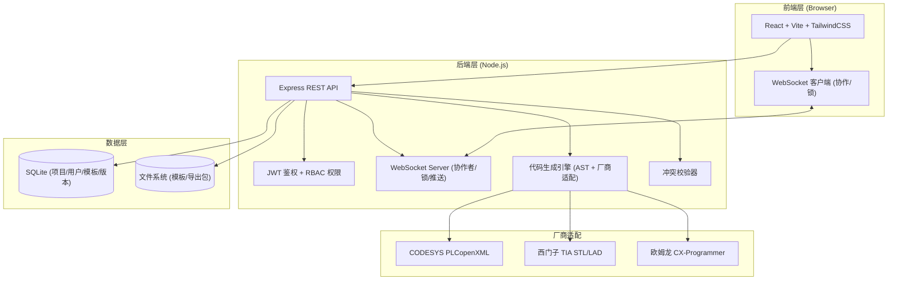
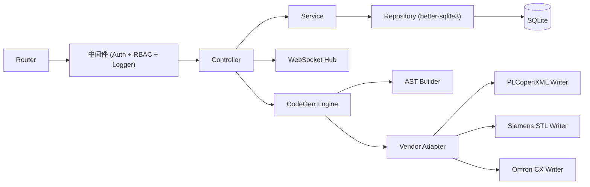
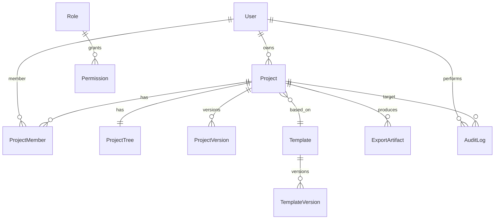

# XGenCode 技术架构文档

## 1. 架构设计

XGenCode 采用前后端分离 + WebSocket 实时协作的三层架构。前端以 React + Vite 构建 IDE 风格工作区；后端 Express 提供 REST API 与 WebSocket，负责权限/项目/模板/代码生成；数据层使用 SQLite（文件级，零运维）持久化，并通过乐观锁 + 节点级编辑锁实现多人并发协作。



## 2. 技术说明

- **前端**：React 18 + react-router-dom 6 + TailwindCSS 3 + Vite 5
- **状态管理**：Zustand（轻量全局状态）+ React Query（服务端数据缓存）
- **UI 组件**：自研组件 + lucide-react 图标 + framer-motion 动效
- **代码编辑/预览**：Monaco Editor + Prism 语法高亮
- **树形组件**：自研虚拟树（支持拖拽、右键、海量节点）
- **后端**：Express 4 + jsonwebtoken + bcryptjs + ws (WebSocket) + better-sqlite3
- **代码生成**：自研 AST 模块 + xml2js (PLCopenXML) + 厂商模板字符串
- **数据库**：SQLite (better-sqlite3 同步驱动，零运维)
- **并发控制**：节点级编辑锁（Redis-like 内存锁）+ 乐观锁版本号 + WebSocket 实时推送
- **认证授权**：JWT + RBAC 四角色矩阵
- **构建工具**：Vite (前端) + tsx (后端热载)

## 3. 路由定义

| 路由 | 用途 |
|------|------|
| `/login` | 登录页 |
| `/dashboard` | 工作台仪表盘 |
| `/projects/new` | 新建项目 + 选择模板 |
| `/projects/:id` | 项目工作区（三栏 IDE） |
| `/projects/:id/config/:module` | 业务配置中心子模块 |
| `/projects/:id/export` | 跨平台导出页 |
| `/projects/:id/ast` | AST 预览页 |
| `/projects/:id/validate` | 冲突校验页 |
| `/projects/:id/bom` | BOM/图纸输出页 |
| `/templates` | 模板管理列表 |
| `/templates/:id` | 模板版本/编辑详情 |
| `/admin/users` | 用户管理 |
| `/admin/permissions` | 权限矩阵 |

## 4. API 定义

### 4.1 鉴权

```typescript
POST /api/auth/login      { username, password } → { token, user }
POST /api/auth/register   { username, password, inviteCode } → { token, user }
GET  /api/auth/me         → { user, permissions }
```

### 4.2 项目

```typescript
GET    /api/projects                  → Project[]
POST   /api/projects                   { name, industry, templateId } → Project
GET    /api/projects/:id               → Project
PATCH  /api/projects/:id               { name?, status? } → Project
DELETE /api/projects/:id               → { ok }
GET    /api/projects/:id/tree          → TreeNode[]
PATCH  /api/projects/:id/tree          { nodeId, change, baseVersion } → { version, conflicts? }
GET    /api/projects/:id/config/:module → ModuleConfig
PUT    /api/projects/:id/config/:module  { config, baseVersion } → { version }
```

### 4.3 模板

```typescript
GET   /api/templates                   → Template[]
GET   /api/templates/:id               → Template
GET   /api/templates/:id/versions      → TemplateVersion[]
POST  /api/templates/:id/versions      { content, note } → TemplateVersion
POST  /api/templates/:id/rollback      { versionId } → Template
POST  /api/templates                   { name, industry, content } → Template
```

### 4.4 生成与导出

```typescript
POST /api/projects/:id/validate        → { ok, issues: Conflict[] }
POST /api/projects/:id/ast             → { ast: ASTNode }
POST /api/projects/:id/export          { vendor: 'CODESYS'|'SIEMENS'|'OMRON' } → { files: ExportFile[] }
POST /api/projects/:id/bom             → { bom: BOMItem[], eplan: EplanData }
```

### 4.5 用户与权限

```typescript
GET    /api/users                      → User[]
POST   /api/users                      { username, password, role } → User
PATCH  /api/users/:id                  { role?, status? } → User
GET    /api/permissions/matrix         → PermissionMatrix
PUT    /api/permissions/matrix         { matrix } → { ok }
```

### 4.6 WebSocket 协作事件

```typescript
// C→S
{ type: 'join',  projectId }
{ type: 'lock',  projectId, nodeId }
{ type: 'unlock',projectId, nodeId }
{ type: 'edit',  projectId, nodeId, patch, baseVersion }
// S→C
{ type: 'presence', users: Presence[] }
{ type: 'locked',   nodeId, by }
{ type: 'unlocked', nodeId }
{ type: 'updated',  nodeId, patch, version }
{ type: 'conflict', nodeId, reason }
```

## 5. 服务端架构图



## 6. 数据模型

### 6.1 数据模型定义



### 6.2 数据定义语言

```sql
-- 用户
CREATE TABLE users (
  id TEXT PRIMARY KEY,
  username TEXT UNIQUE NOT NULL,
  password_hash TEXT NOT NULL,
  role TEXT NOT NULL CHECK(role IN ('ADMIN','ENGINEER','GUEST','TEMPLATE_MAINTAINER')),
  status TEXT NOT NULL DEFAULT 'ACTIVE',
  created_at INTEGER NOT NULL
);

-- 角色
CREATE TABLE roles (
  name TEXT PRIMARY KEY,
  description TEXT
);

-- 权限矩阵 (role × resource × action)
CREATE TABLE permissions (
  role TEXT NOT NULL,
  resource TEXT NOT NULL,
  action TEXT NOT NULL CHECK(action IN ('read','write','delete','approve')),
  PRIMARY KEY (role, resource, action)
);

-- 模板
CREATE TABLE templates (
  id TEXT PRIMARY KEY,
  name TEXT NOT NULL,
  industry TEXT NOT NULL,
  current_version_id TEXT,
  created_at INTEGER NOT NULL,
  FOREIGN KEY (current_version_id) REFERENCES template_versions(id)
);

CREATE TABLE template_versions (
  id TEXT PRIMARY KEY,
  template_id TEXT NOT NULL,
  version_no INTEGER NOT NULL,
  content TEXT NOT NULL, -- JSON 模板内容
  note TEXT,
  created_by TEXT NOT NULL,
  created_at INTEGER NOT NULL,
  FOREIGN KEY (template_id) REFERENCES templates(id),
  FOREIGN KEY (created_by) REFERENCES users(id)
);

-- 项目
CREATE TABLE projects (
  id TEXT PRIMARY KEY,
  name TEXT NOT NULL,
  industry TEXT NOT NULL,
  template_id TEXT NOT NULL,
  template_version_id TEXT NOT NULL,
  owner_id TEXT NOT NULL,
  status TEXT NOT NULL DEFAULT 'DRAFT',
  current_version INTEGER NOT NULL DEFAULT 1,
  created_at INTEGER NOT NULL,
  updated_at INTEGER NOT NULL,
  FOREIGN KEY (template_id) REFERENCES templates(id),
  FOREIGN KEY (owner_id) REFERENCES users(id)
);

-- 项目成员 (协作)
CREATE TABLE project_members (
  project_id TEXT NOT NULL,
  user_id TEXT NOT NULL,
  permission TEXT NOT NULL CHECK(permission IN ('read','write','admin')),
  PRIMARY KEY (project_id, user_id)
);

-- 项目版本 (乐观锁 + 历史回滚)
CREATE TABLE project_versions (
  id TEXT PRIMARY KEY,
  project_id TEXT NOT NULL,
  version_no INTEGER NOT NULL,
  snapshot TEXT NOT NULL, -- 完整 JSON 快照
  change_note TEXT,
  created_by TEXT NOT NULL,
  created_at INTEGER NOT NULL,
  FOREIGN KEY (project_id) REFERENCES projects(id)
);

-- 节点编辑锁 (运行时表，启动时清空)
CREATE TABLE node_locks (
  project_id TEXT NOT NULL,
  node_id TEXT NOT NULL,
  user_id TEXT NOT NULL,
  acquired_at INTEGER NOT NULL,
  expires_at INTEGER NOT NULL,
  PRIMARY KEY (project_id, node_id)
);

-- 导出制品
CREATE TABLE export_artifacts (
  id TEXT PRIMARY KEY,
  project_id TEXT NOT NULL,
  vendor TEXT NOT NULL,
  file_path TEXT NOT NULL,
  file_size INTEGER NOT NULL,
  created_by TEXT NOT NULL,
  created_at INTEGER NOT NULL
);

-- 审计日志
CREATE TABLE audit_logs (
  id TEXT PRIMARY KEY,
  user_id TEXT NOT NULL,
  project_id TEXT,
  action TEXT NOT NULL,
  detail TEXT,
  created_at INTEGER NOT NULL
);

-- 索引
CREATE INDEX idx_projects_owner ON projects(owner_id);
CREATE INDEX idx_versions_project ON project_versions(project_id, version_no);
CREATE INDEX idx_audit_user ON audit_logs(user_id, created_at);
CREATE INDEX idx_audit_project ON audit_logs(project_id, created_at);
```

### 6.3 并发与权限关键设计

**乐观锁**：所有 `PATCH /api/projects/:id/*` 请求必须携带 `baseVersion`，服务端比对 `projects.current_version`，不一致则返回 `409 Conflict` + 最新版本，触发前端合并。

**节点级编辑锁**：通过 WebSocket 获取 `lock` 事件，写入 `node_locks` 表（30s TTL，心跳续期）。同一节点同一时刻仅一个用户可编辑，其他用户进入只读并显示锁定者。锁超时自动释放，避免死锁。

**RBAC 权限校验中间件**：每个路由声明所需 `resource + action`，中间件查 `permissions` 表判断放行；项目级权限额外查 `project_members`。

**审计**：所有写操作落 `audit_logs`，支持追溯。
