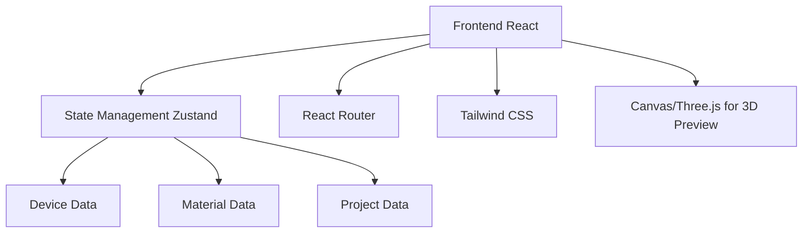

## 1. Architecture Design
采用前后端分离架构，前端使用React框架实现交互式界面，后端使用Express提供API服务，本地存储使用Zustand状态管理，无需外部数据库。



## 2. Technology Description
- **Frontend**: React@18 + TypeScript + tailwindcss@3 + vite
- **Initialization Tool**: vite-init
- **Backend**: Express@4 + TypeScript
- **Database**: Local storage (Zustand) for demo purposes
- **3D Visualization**: Canvas + Three.js

## 3. Route Definitions
| Route | Purpose |
|-------|---------|
| / | Dashboard 首页 |
| /device-info | 设备信息对接页面 |
| /material-selection | 物料选型页面 |
| /drawing-output | 自动图纸输出页面 |
| /program-generation | 自动程序编写页面 |

## 4. Data Model

### 4.1 数据结构定义

```typescript
// 设备信息
interface DeviceInfo {
  id: string;
  name: string;
  type: string;
  parameters: Record<string, any>;
  createdAt: Date;
  updatedAt: Date;
}

// 物料信息
interface Material {
  id: string;
  name: string;
  category: string;
  specifications: Record<string, any>;
  price: number;
  supplier: string;
}

// 项目信息
interface Project {
  id: string;
  name: string;
  status: 'draft' | 'in-progress' | 'completed';
  deviceInfo: DeviceInfo | null;
  selectedMaterials: Material[];
  drawings: Drawing[];
  programs: Program[];
  progress: number;
  createdAt: Date;
  updatedAt: Date;
}

// 图纸信息
interface Drawing {
  id: string;
  name: string;
  type: '2d' | '3d';
  format: string;
  data: string;
  createdAt: Date;
}

// 程序信息
interface Program {
  id: string;
  name: string;
  language: string;
  code: string;
  version: string;
  createdAt: Date;
}
```

### 4.2 状态管理 (Zustand Store)

```typescript
interface AppStore {
  currentProject: Project | null;
  projects: Project[];
  materials: Material[];
  setCurrentProject: (project: Project | null) => void;
  addProject: (project: Project) => void;
  updateProject: (id: string, updates: Partial<Project>) => void;
  setMaterials: (materials: Material[]) => void;
  addMaterial: (material: Material) => void;
}
```

## 5. File Structure
```
/workspace
├── src/
│   ├── components/
│   │   ├── Layout.tsx
│   │   ├── Sidebar.tsx
│   │   ├── ProjectCard.tsx
│   │   ├── MaterialCard.tsx
│   │   └── CodeEditor.tsx
│   ├── pages/
│   │   ├── Dashboard.tsx
│   │   ├── DeviceInfo.tsx
│   │   ├── MaterialSelection.tsx
│   │   ├── DrawingOutput.tsx
│   │   └── ProgramGeneration.tsx
│   ├── store/
│   │   └── useStore.ts
│   ├── utils/
│   │   ├── drawingGenerator.ts
│   │   ├── programGenerator.ts
│   │   └── materialRecommender.ts
│   ├── types/
│   │   └── index.ts
│   ├── App.tsx
│   └── main.tsx
├── api/
│   ├── index.ts
│   └── routes/
│       ├── projects.ts
│       └── materials.ts
├── shared/
│   └── types.ts
├── package.json
├── vite.config.ts
├── tailwind.config.js
└── tsconfig.json
```

## 6. Core Module Implementation

### 6.1 图纸生成器
基于设备参数和选型物料，使用Canvas或SVG自动生成2D/3D图纸，支持DWG、DXF、PDF等格式导出。

### 6.2 程序生成器
根据设计方案自动生成PLC程序、机器人控制程序等，支持ST语言、梯形图、G代码等多种格式。

### 6.3 物料推荐引擎
基于设备参数和历史数据，智能推荐合适的物料，支持多维度对比分析。
