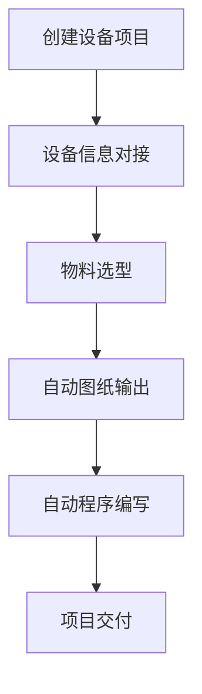

## 1. Product Overview
设备项目设计流工具是一个全流程自动化设备设计平台，旨在解决传统设备设计流程中效率低下、信息孤岛、重复劳动等问题。该平台通过集成设备信息对接、物料选型、自动图纸输出和自动程序编写等核心功能，实现从需求到交付的一站式自动化设计流程，大幅提升设备设计效率和质量。

## 2. Core Features

### 2.1 User Roles
| Role | Registration Method | Core Permissions |
|------|---------------------|------------------|
| Designer | Email registration | 创建设备项目、使用所有设计功能、导出成果 |

### 2.2 Feature Module
1. **Dashboard**: 项目概览、快速操作入口、最近项目展示
2. **设备信息对接**: 设备参数录入、接口配置、数据验证
3. **物料选型**: 物料数据库、智能推荐、对比分析、选型确认
4. **自动图纸输出**: 2D/3D图纸生成、参数化设计、图纸预览、图纸导出
5. **自动程序编写**: PLC/机器人程序生成、代码预览、程序下载

### 2.3 Page Details
| Page Name | Module Name | Feature description |
|-----------|-------------|---------------------|
| Dashboard | Project Overview | 显示项目进度、完成率、关键指标 |
| 设备信息对接 | 参数录入 | 表单式参数输入、数据类型验证、参数模板保存 |
| 设备信息对接 | 接口配置 | 支持多种接口协议、连接测试、数据导入 |
| 物料选型 | 物料搜索 | 分类筛选、关键词搜索、高级筛选 |
| 物料选型 | 智能推荐 | 基于设备参数的物料推荐、历史选型记录 |
| 物料选型 | 对比分析 | 多物料参数对比、性能评分 |
| 自动图纸输出 | 图纸生成 | 参数化自动生成、多种格式支持 |
| 自动图纸输出 | 图纸预览 | 交互式预览、缩放旋转、尺寸标注 |
| 自动程序编写 | 程序生成 | 基于设计方案自动生成代码、多种编程语言支持 |
| 自动程序编写 | 程序下载 | 代码下载、版本管理、在线调试 |

## 3. Core Process
用户登录系统 → 创建设备项目 → 录入设备信息 → 进行物料选型 → 生成图纸 → 编写程序 → 导出交付成果。

## 4. User Interface Design

### 4.1 Design Style
- **主色调**: 深蓝色 (#1E3A8A) 搭配科技青 (#0EA5E9)
- **辅助色**: 橙色 (#F97316) 用于强调、绿色 (#10B981) 用于成功状态
- **按钮风格**: 圆角矩形、渐变背景、悬停动画效果
- **字体**: Inter 用于正文、Poppins 用于标题
- **布局风格**: 卡片式布局、左侧导航栏、顶部工具栏
- **图标风格**: Lucide React 线性图标，简洁现代

### 4.2 Page Design Overview
| Page Name | Module Name | UI Elements |
|-----------|-------------|-------------|
| Dashboard | Project Overview | 统计卡片、进度条、项目列表、快速操作按钮 |
| 设备信息对接 | 参数录入 | 分步骤表单、输入验证提示、参数卡片、保存模板功能 |
| 物料选型 | 物料列表 | 网格布局卡片、筛选侧边栏、对比功能 |
| 自动图纸输出 | 图纸预览 | 大尺寸预览区域、工具栏、参数面板、导出按钮 |
| 自动程序编写 | 代码编辑器 | 语法高亮、行号显示、下载按钮、版本历史 |

### 4.3 Responsiveness
桌面端优先设计，支持平板和移动端自适应布局，关键功能在小屏幕设备上保持可用。

### 4.4 Interaction Design
- 页面切换采用淡入淡出过渡动画
- 按钮悬停时具有上浮和阴影加深效果
- 进度实时更新，采用平滑动画过渡
- 表单输入具有即时验证反馈
