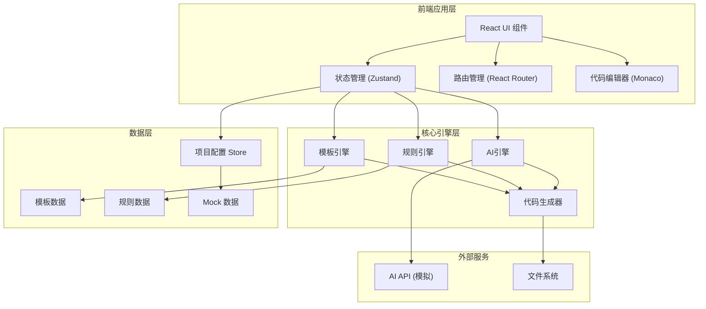
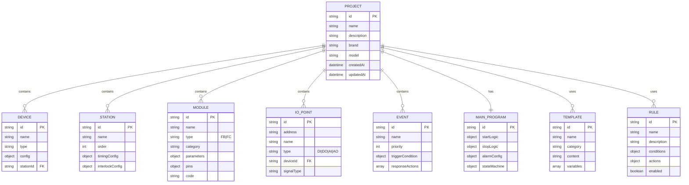

## 1. 架构设计



## 2. 技术描述

- **前端框架**: React@18 + TypeScript
- **构建工具**: Vite@5
- **样式方案**: TailwindCSS@3 + CSS Variables
- **状态管理**: Zustand
- **路由**: React Router@6
- **代码编辑器**: @monaco-editor/react
- **图标**: lucide-react
- **UI组件库**: 自定义组件 + Radix UI primitives
- **拖拽**: @dnd-kit/core + @dnd-kit/sortable
- **数据持久化**: localStorage + IndexedDB (模拟后端)

## 3. 目录结构

```
src/
├── components/          # 通用UI组件
│   ├── layout/         # 布局组件
│   ├── tree/           # 树形组件
│   ├── forms/          # 表单组件
│   └── code-editor/    # 代码编辑器
├── pages/              # 页面组件
│   ├── dashboard/      # 工作台
│   ├── template/       # 模板管理
│   ├── rules/          # 规则引擎
│   ├── ai-assistant/   # AI助手
│   ├── device-config/  # 设备配置
│   ├── station-config/ # 工位配置
│   ├── module-config/  # 模块配置
│   ├── io-config/      # IO配置
│   ├── event-config/   # 事件配置
│   ├── main-program/   # 主程序配置
│   └── code-gen/       # 代码生成下载
├── store/              # 状态管理
│   ├── projectStore.ts
│   ├── templateStore.ts
│   └── ruleStore.ts
├── engines/            # 核心引擎
│   ├── templateEngine.ts
│   ├── ruleEngine.ts
│   ├── aiEngine.ts
│   └── codeGenerator.ts
├── types/              # TypeScript类型定义
├── data/               # Mock数据
├── utils/              # 工具函数
├── hooks/              # 自定义Hooks
├── styles/             # 全局样式
├── App.tsx
└── main.tsx
```

## 4. 路由定义

| 路由路径 | 页面名称 | 说明 |
|----------|----------|------|
| `/` | 工作台 | 项目列表、快速创建、模板推荐 |
| `/project/:id` | 项目配置 | 项目主页面，左侧树+右侧配置区 |
| `/project/:id/device` | 设备配置 | 三色灯、按钮、传感器等配置 |
| `/project/:id/station` | 工位配置 | 工位定义、时序、互锁配置 |
| `/project/:id/module` | 模块配置 | FB/FC库管理、模块实例化 |
| `/project/:id/io` | IO配置 | IO点位映射、地址分配 |
| `/project/:id/event` | 事件配置 | 事件定义、触发条件、响应动作 |
| `/project/:id/main` | 主程序配置 | 启动/停止/报警逻辑配置 |
| `/project/:id/template` | 模板管理 | 模板库、模板编辑器 |
| `/project/:id/rules` | 规则引擎 | 规则列表、规则编辑器 |
| `/project/:id/ai` | AI助手 | AI对话面板 |
| `/project/:id/generate` | 代码生成 | 品牌选择、代码预览、下载 |

## 5. 数据模型

### 5.1 项目数据模型



### 5.2 核心类型定义

```typescript
// 项目类型
interface Project {
  id: string;
  name: string;
  description: string;
  brand: PLCBrand;
  model: string;
  devices: Device[];
  stations: Station[];
  modules: PLCModule[];
  ioPoints: IOPoint[];
  events: EventConfig[];
  mainProgram: MainProgram;
  createdAt: Date;
  updatedAt: Date;
}

// PLC品牌
type PLCBrand = 'siemens' | 'mitsubishi' | 'omron' | 'delta';

// 设备类型
type DeviceType = 'threeColorLight' | 'button' | 'sensor' | 'actuator' | 'motor' | 'valve';

interface Device {
  id: string;
  name: string;
  type: DeviceType;
  stationId?: string;
  config: Record<string, any>;
  ioBindings: string[];
}

// 模块类型
type ModuleType = 'FB' | 'FC';

interface PLCModule {
  id: string;
  name: string;
  type: ModuleType;
  category: string;
  description: string;
  parameters: ModuleParameter[];
  inputPins: ModulePin[];
  outputPins: ModulePin[];
  code: string;
}

// IO点
type IOType = 'DI' | 'DO' | 'AI' | 'AO';

interface IOPoint {
  id: string;
  address: string;
  name: string;
  type: IOType;
  deviceId?: string;
  signalType: string;
  description: string;
}

// 模板变量
interface TemplateVariable {
  name: string;
  type: 'string' | 'number' | 'boolean' | 'select';
  default: any;
  description: string;
  options?: string[];
}

interface CodeTemplate {
  id: string;
  name: string;
  category: string;
  brand: PLCBrand | 'all';
  content: string;
  variables: TemplateVariable[];
}

// 规则定义
interface RuleCondition {
  field: string;
  operator: '==' | '!=' | '>' | '<' | '>=' | '<=' | 'contains' | 'startsWith';
  value: any;
}

interface RuleAction {
  type: 'generate' | 'modify' | 'validate' | 'warn';
  params: Record<string, any>;
}

interface Rule {
  id: string;
  name: string;
  description: string;
  conditions: RuleCondition[];
  conditionLogic: 'AND' | 'OR';
  actions: RuleAction[];
  enabled: boolean;
  priority: number;
}
```

## 6. 三大引擎设计

### 6.1 模板引擎
- 基于变量替换的模板渲染
- 支持条件渲染 `{{#if condition}}...{{/if}}`
- 支持循环渲染 `{{#each items}}...{{/each}}`
- 支持模板嵌套和继承
- 内置过滤器（大写、小写、格式化等）

### 6.2 规则引擎
- 条件-动作（Condition-Action）规则模型
- 支持规则优先级和冲突解决
- 规则链执行（前向链式推理）
- 支持规则测试和验证
- 规则触发：代码生成前校验、生成中修改、生成后优化

### 6.3 AI引擎（模拟实现）
- 智能代码补全：基于上下文推荐代码片段
- 逻辑推荐：根据设备配置推荐控制逻辑
- 异常检测：自动识别配置中的潜在问题
- 自然语言生成：用自然语言描述生成PLC逻辑
- 模拟AI响应：预置智能推荐库，演示AI效果

## 7. 代码生成流程

1. **配置收集**：从项目Store中收集所有配置数据
2. **模板匹配**：根据PLC品牌匹配合适的代码模板
3. **规则校验**：运行规则引擎校验配置合法性
4. **模板渲染**：模板引擎将配置数据注入模板
5. **AI优化**：AI引擎对生成代码进行智能优化
6. **代码组装**：按程序结构组装各模块代码
7. **格式校验**：语法和格式检查
8. **输出生成**：生成最终程序文件包
